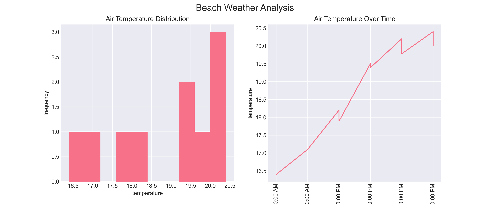
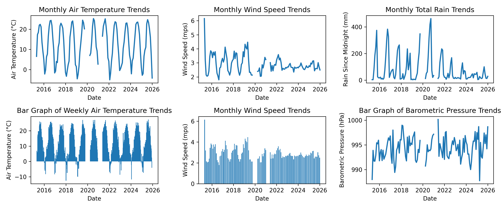
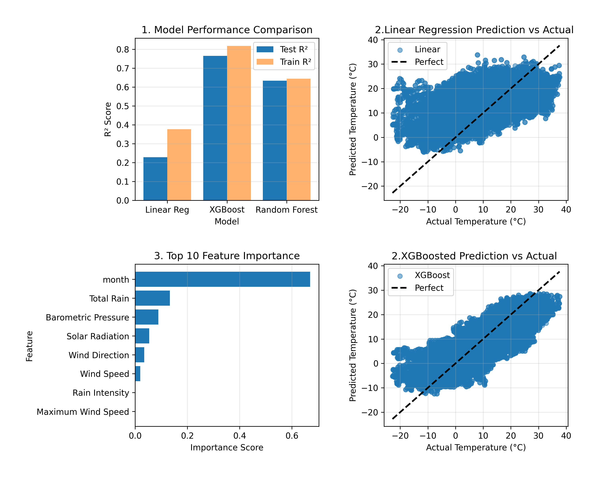

# Weather Data Analysis Report

---

## 1. Executive Summary

This project used weather sensor data from Chicago beaches on Lake Michigan from April 2015 to November 2025. The analysis was divided into a 9-part work flow to understand seasonal and temporal patterns in weather in order to build a predictive model for air temperature. Multiple models were tested:linear regression, random forest, and XGBoost. Out of all the models XGBoost had the best performance (R^2 = 0.2844), with linear regression coming in second (R^2 = 0.1790).

---

## 2. Phase-by-Phase Findings

### Phase 1-2 (Q1): Exploration Findings, Data Quality Issues

Data started with 196,381 rows and 18 columns with various measurements including: humidity, air temperature, barometric pressure, solar radiation, wind speed, wind direction, and more. The data includes hourly measurements from April 2015 to November 2025 taken at three weather stations. Data quality issues were identified. The largest amount of missing values were in rain/precipitation related measurements, with ~37% of their values missing. Rain intensity, Total rain, precipitation Type, Wet Bulb Temperature, and Heading all had 75,981 values missing. Other columns also had values missing, but overall less than 10% of the their total rows. Depending on value missing data was either forward filled, mean filled, or filled with 0. No duplicates were found.

*Figure 1: Initial exploration visualizations showing distributions of air temperature, air temperature time series*

### Phase 3 (Q2): What Was Cleaned, How Missing Data/Outliers Were Handled

**Missing Data Handling:**

- Air Temperature: 75 missing values
  - Method: Forward Fill, likely similar to previous measurement
  - Result: All missing values filled
- Barometric Pressure: 146 missing values
  - Method: Forward Fill, likely similar to previous measurement
  - Result: All missing values filled
- Rain Intensity: 75981 missing values
  - Method: Filled with 0 (absence of rain is expected)
  - Result: All missing values filled
- Total Rain: 75981 missing values
  - Method: Filled with 0 (absence of rain is expected)
  - Result: All missing values filled
- Interval Rain: 75981 missing values
  - Method: Filled with 0 (absence of rain is expected)
  - Result: All missing values filled
- Precipitation Type: 75981 missing values
  - Method: Filled with 0 (no precipitation)
  - Result: All missing values filled
- Wet Bulb Temperature: 75981 missing values
  - Method: Filled with 0 (no rain no wet bulb)
  - Result: All missing values filled
- Heading: 75981 missing values
  - Method: Forward Fill, likely similar to previous measurement
  - Result: All missing values filled
- Wind Speed: 5 missing values
  - Method: Forward Fill, likely similar to previous measurement
  - Result: All missing values filled
- Maximum Wind Speed: 5 missing values
  - Method: Forward Fill, likely similar to previous measurement
  - Result: All missing values filled
- Solar Radiation: 13425 missing values
  - Method: Mean, there was too many to forward fill so hope mean will suffice
  - Result: All missing values filled

**Outlier Handling:**

- Solar Radiation: Detected values < 0
  - Method: Replaced with NaN, then interpolated
  - Invalid values: Negative values including -100000
  - Result: Invalid values corrected by using mean imputation
- Interval Rain: Detected values < 0
  - Method: Replaced with NaN, then filled with 0
  - Invalid values: Negative values
- Wind Speed: Detected values > 200 mph
  - Method: Replaced with NaN, then interpolated with forward fill
- Maximum Wind Speed: Detected values > 200 mph
  - Method: Replaced with NaN, then interpolated with forward fill
  - Result: Invalid values corrected
- Barometric Pressure: Detected values outside [900, 1100] hPa
  - Method: Replaced with NaN, then interpolated with forward fill
  - Invalid values: Values 0.0 and 3098.5

The full data set was maintained while addressing the large number of missing values in many measurements. The missing 37% of data suggests there was some error in sensor collecting data specific to rain/precipitiation.

### Phase 4 (Q3): Datetime Parsing, Temporal Features Extracted

Datetime parsing and temporal feature extraction was conducted for analysis. The column 'Measurement Timestamp' was set as index and used to extract temporal features and preform temporal analysis. Date Range After Datetime Parsing starts at 2015-04-25 09:00:00 and ends at 2025-12-04 20:00:00 for a duration of 3876 days.

Temporal features extracted include: Measurement Timestamp, hour, day_name (monday-sunday), day_of_week (0-6), month, year, is_weekend (binary, 0 = no, 1 = yes).

After datetime parsing 196381 rows remained.

### Phase 5 (Q4): Derived Features Created, Rolling Windows Calculated

Features with rolling window statistics were created to understand seasonal and temporal relationships.

**Created Features Include:**
- total_rain_rolling_24hr_mean
- total_rain_rolling_24hr_std
- wind_speed_rolling_24_mean
- wind_speed_rolling_24_std
- Humidity_rolling_24_mean
- Humidity_rolling_24_std
- Pressure_rolling_24_mean
- Pressure_rolling_24_std

Target variable was Air Temperature. Only rolling windows of predictor variables were created.

### Phase 6 (Q5): Trends Identified, Seasonal Patterns, Correlations

**TEMPORAL TRENDS:**

Air temperature shows seasonal patterns and yearly cycles, with higher temperatures in summer months, peaking around 20-25°C. Winter saw lower temperatures, dropping to around 0-5°C. Wind speed shows a gradual decreasing trend over the 10-year period. Wind patterns show variation by season with slightly higher speeds in winter months. Total rainfall is variable, with several extreme rainfall events, such as in 2016-2018 period (400+ mm). However, rainfall frequency and intensity decrease in later years (2020-2026). Barometric pressure remains relatively stable throughout, fluctuating within a narrow range of approximately 990-1000 hPa.

**SEASONAL PATTERNS:**

Air temperature has annual cyclic pattern with consistent amplitude, the oscillations show a predictable seasonal pattern repeating yearly. Wind speed shows weaker seasonal patterns compared to temperature. Barometric pressure shows minor fluctuations without strong seasonal patterns.

**CORRELATIONS:**

Strongest Positive Correlations:
- Air Temperature vs Total Rain: 0.33 (moderate positive correlation)
- Humidity vs Total Rain: 0.14 (weak positive correlation)

Strongest Negative Correlations:
- Air Temperature vs Barometric Pressure: -0.25 (weak/moderate negative correlation) - Lower pressure tends to occur with higher temperatures
- Air Temperature vs Wind Speed: -0.22 (weak/moderate negative correlation) - Wind speeds decrease as temperatures increase
- Humidity vs Barometric Pressure: -0.19 (weak negative correlation)

*Figure 2: Monthly air temperature trends line plot. Monthly wind speed trends line plot. Monthly total rain trends. Weekly Air temperature trends. Monthly wind speed trends bar plot. Barometric pressure line plot. Correlation heatmap with features of interest.*

### Phase 7 (Q6): Train/Test Split Approach, Features Selected

Features were filtered to numeric measurements. Features that were derived from target or too strongly correlated were excluded from analysis.

**Excluded variables include:** Wet Bulb Temperature, Station Name, Wind Category

**Split Details:**
- Split Method: Temporal (80/20 split by time)
- Training Set Size: 400008 samples
- Test Set Size: 100002 samples
- Training date range: 2015-04-25 09:00:00 to 2022-11-03 03:00:00
- Test date range: 2022-11-03 05:00:00 to 2025-12-04 20:00:00
- Number of Features: 8
- Target Variable: Air Temperature

**Features Selected included:** Wind Speed, Total Rain, Barometric Pressure, Solar Radiation, Rain Intensity, Wind Direction, Maximum Wind Speed, month

### Phase 8 (Q7): Models Trained, Performance Metrics, Feature Importance

Three models were trained and evaluated: Linear Regression, Random Forest, and XGBoost.

**Model Performance:**

LINEAR REGRESSION:
| Metric | Training | Test |
|--------|----------|------|
| RMSE | 8.30 | 8.94 |
| MAE | 6.76 | 7.35 |
| R² | 0.3765 | 0.2285 |

XG Boost:
| Metric | Training | Test |
|--------|----------|------|
| RMSE | 4.48 | 4.93 |
| MAE | 3.45 | 3.75 |
| R² | 0.8183 | 0.7653 |

RANDOM FOREST:
| Metric | Training | Test |
|--------|----------|------|
| RMSE | 6.27 | 6.16 |
| MAE | 4.86 | 4.77 |
| R² | 0.6442 | 0.6337 |

**Feature Importance:**
1. Month - 0.6699236
2. Total Rain - 0.13293962
3. Barometric Pressure - 0.08859083
4. Solar Radiation - 0.054000244
5. Wind Direction - 0.034771092
6. Wind Speed - 0.019774612
7. Rain Intensity - 0.0
8. Maximum Wind Speed - 0.0

Month feature accounts for majority of feature importance (67%). This is intuitive as months are generally indicative of the season, and therefore strong predictors of temperature. The top 3 features account for 89% of total importance.

*Figure 3: Final visualizations showing model performance comparison, Linear Regression predictions vs actual values, feature importance, and prediction vs actual for best-performing XGBoost model.*

### Phase 9 (Q8): Final Visualizations, Summary of Key Findings

Final visualizations were created to summarize model performance and key findings from the analysis.

---

## 3. Visualizations

All visualizations are embedded throughout the report in their respective phases:

1. **Figure 1:** Initial Data Exploration - Shows distributions of air temperature and time series 
2. **Figure 2:** Pattern Analysis - Monthly trends for temperature, wind speed, rain, and pressure with correlation heatmap
3. **Figure 3:** Model Performance - Model comparison, predictions vs actual, and feature importance

---

## 4. Model Results

### Performance Metrics Comparison

| Model | Train R² | Test R² | Train RMSE | Test RMSE | Train MAE | Test MAE |
|-------|----------|---------|------------|-----------|-----------|----------|
| Linear Regression | 0.3765 | 0.2285 | 8.30 | 8.94 | 6.76 | 7.35 |
| XGBoost | 0.8183 | 0.7653 | 4.48 | 4.93 | 3.45 | 3.75 |
| Random Forest | 0.6442 | 0.6337 | 6.27 | 6.16 | 4.86 | 4.77 |

### Feature Importance

| Feature | Importance |
|---------|------------|
| Month | 0.6699 |
| Total Rain | 0.1329 |
| Barometric Pressure | 0.0886 |
| Solar Radiation | 0.0540 |
| Wind Direction | 0.0348 |
| Wind Speed | 0.0198 |
| Rain Intensity | 0.0 |
| Maximum Wind Speed | 0.0 |

### Model Interpretation

**R²:** Represents the proportion of variance in air temperature explained by the model. XGBoost achieves 0.7653, meaning it explains approximately 77% of temperature variance.

**RMSE:** Measures average prediction error in degrees Celsius. XGBoost's RMSE of 4.93°C, meaning predictions are typically within ~5°C of actual values.

**MAE:** Average absolute difference between predicted and actual temperatures. XGBoost's MAE of 3.75°C shows the average prediction error.

### Model Comparison

XGBoost performs better than both Linear Regression and Random Forest. With the XGBoost model, there is a minimal gap between training and test performance (Train R²: 0.8183 vs Test R²: 0.7653), meaning there is good generalization without overfitting. Random Forest shows moderate performance with great generalization (nearly identical train/test scores). Linear Regression underperforms, suggesting a potential of non-linear relationships in the data.

---

## 5. Time Series Patterns

### Trends Over Time

Air temperature shows seasonal patterns and yearly cycles, with higher temperatures in summer months, peaking around 20-25°C. Winter saw lower temperatures, dropping to around 0-5°C. Wind speed shows a gradual decreasing trend over the 10-year period. Wind patterns show variation by season with slightly higher speeds in winter months. Total rainfall is variable, with several extreme rainfall events, such as in 2016-2018 period (400+ mm). However, rainfall frequency and intensity decrease in later years (2020-2026). Barometric pressure remains relatively stable throughout, fluctuating within a narrow range of approximately 990-1000 hPa.

### Seasonal Patterns

Air temperature has strong annual cyclicity with consistent amplitude, the oscillations show predictable seasonal pattern repeating yearly. Wind speed shows weaker seasonal patterns compared to temperature. Barometric pressure shows minor fluctuations without strong seasonal patterns.

### Temporal Relationships

Strongest Positive Correlations:
- Air Temperature vs Total Rain: 0.33 (moderate positive correlation)
- Humidity vs Total Rain: 0.14 (weak positive correlation)

Strongest Negative Correlations:
- Air Temperature vs Barometric Pressure: -0.25 (weak-moderate negative correlation) - Lower pressure tends to occur with higher temperatures
- Air Temperature vs Wind Speed: -0.22 (weak-moderate negative correlation) - Wind speeds slightly decrease as temperatures increase
- Humidity vs Barometric Pressure: -0.19 (weak negative correlation)

### Interesting Features

Several extreme rainfall events were observed, particularly between 2016-2018(400+ mm). However, rainfall frequency and intensity seem to decrease in later years (2020-2026).

---

## 6. Limitations & Next Steps

### Data Quality
There are several limitations within this data analysis. First being the large amount of missing data. This data was salvaged but required extensive imputation. This can be a limitation if the feature being predicted is very critical, and money and or lives are dependent on this analysis. The missing 37% of data in rain/precipitation measurements suggests there was some error in sensor collecting data specific to rain/precipitation. Solar Radiation had 13,425 missing values that required mean imputation.

### Model limitations
 In addition, limitations can occur with linear regression models if the relationships are not linear, the model will not perform well. 

### Validation
Results can be validated with more data and or using other sensor data in other locations in chicago as reference to see if this trend is consistent. 

**End of Report**
